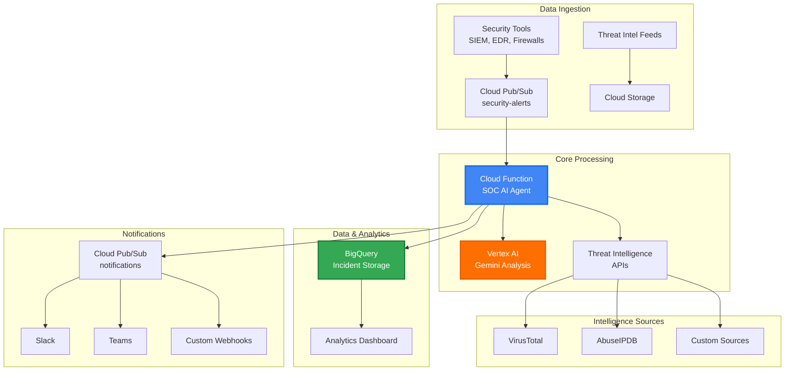

# 🛡️ SOC AI Agent: Google Cloud-Native Threat Analyst

<div align="center">


**A production-ready, AI-powered Security Operations Center agent built natively on Google Cloud Platform**

[Features](#-features) • [Quick Start](#-quick-start) • [Architecture](#-architecture) • [Documentation](#-documentation) • [Contributing](#-contributing)

</div>

---

## 🚀 Overview

The SOC AI Agent is a sophisticated, cloud-native security automation platform that acts as a force multiplier for human security analysts. Built entirely on Google Cloud Platform, it leverages advanced AI capabilities to provide autonomous alert triage, threat intelligence enrichment, and automated incident response recommendations.

### 🎯 Why SOC AI Agent?

- **🤖 AI-First Approach**: Powered by Vertex AI Gemini for intelligent threat analysis
- **⚡ Real-Time Processing**: Event-driven architecture with sub-second response times
- **🔍 Comprehensive Analysis**: Combines threat intelligence, entity extraction, and behavioral analysis
- **🎨 Rich Notifications**: Multi-channel alerting with actionable insights
- **📊 Data-Driven**: Full analytics and reporting capabilities via BigQuery
- **🔒 Security-Native**: Built with security best practices and enterprise compliance

## ✨ Features

### 🧠 **Autonomous Alert Triage**
- Automatic severity scoring (1-10 scale) with confidence levels
- False positive detection and filtering
- Multi-source alert correlation and deduplication
- Intelligent alert prioritization based on business context

### 🔍 **Advanced Threat Intelligence**
- **Real-time enrichment** via VirusTotal, AbuseIPDB, and extensible sources
- **Entity extraction** for IPs, domains, file hashes, and usernames
- **Reputation scoring** with confidence metrics
- **Historical context** and frequency analysis

### 🤖 **AI-Powered Analysis**
- **Vertex AI Gemini integration** for natural language threat analysis
- **Structured output parsing** with JSON response formatting
- **Attack vector identification** and blast radius assessment
- **Automated remediation recommendations** with priority levels

### 📱 **Multi-Channel Notifications**
- **Slack integration** with rich message formatting and interactive buttons
- **Microsoft Teams** support with adaptive cards
- **Custom webhooks** for integration with existing tools
- **Severity-based routing** and escalation workflows

### 💾 **Enterprise Data Management**
- **BigQuery integration** with automatic schema management
- **Data retention policies** and archival workflows
- **Real-time analytics** and dashboard capabilities
- **Audit logging** and compliance reporting

### 🏗️ **Cloud-Native Architecture**
- **Serverless deployment** via Google Cloud Functions
- **Event-driven processing** with Pub/Sub messaging
- **Auto-scaling** based on alert volume
- **High availability** with multi-region support

## 🏗️ Architecture



## 🚀 Quick Start

### Prerequisites

- Google Cloud Project with billing enabled
- Python 3.9+
- gcloud CLI installed and authenticated

### 🔧 Installation

1. **Clone and setup the project**:
   ```bash
   git clone https://github.com/Mr-Neutr0n/SOC_AI_AGENT.git
   cd SOC_AI_AGENT
   python setup.py
   ```

2. **Configure environment**:
   ```bash
   cp env.example .env
   # Edit .env with your API keys and project settings
   ```

3. **Deploy to Google Cloud**:
   ```bash
   export GOOGLE_CLOUD_PROJECT=your-project-id
   ./deploy.sh
   ```

### 🧪 Testing

Run comprehensive tests to validate your deployment:

```bash
# Local testing
python test_agent.py --project-id your-project-id --local-only

# Cloud integration testing
python test_agent.py --project-id your-project-id --test-type all

# Test specific scenarios
python test_agent.py --project-id your-project-id --test-type network
```

### 📤 Sending Alerts

Send security alerts via Pub/Sub:

```python
import json
from google.cloud import pubsub_v1

publisher = pubsub_v1.PublisherClient()
topic_path = publisher.topic_path('your-project', 'security-alerts')

alert = {
    'alert_id': 'SEC_001',
    'timestamp': '2024-01-01T12:00:00Z',
    'description': 'Suspicious network activity detected',
    'src_ip': '192.168.1.100',
    'severity': 'high'
}

future = publisher.publish(topic_path, json.dumps(alert).encode())
print(f"Alert published: {future.result()}")
```

## 📊 Sample Output

### AI Analysis Response
```json
{
  "severity_score": 8,
  "threat_category": "Network Intrusion",
  "summary": "Detected suspicious traffic from known malicious IP to internal server...",
  "attack_vector": "Network-based lateral movement",
  "confidence_level": "high",
  "indicators_of_compromise": [
    "185.220.101.32 (Known Tor exit node)",
    "Unusual traffic patterns",
    "Multiple failed authentication attempts"
  ],
  "recommendations": [
    {
      "action": "Block source IP at firewall",
      "priority": "high",
      "rationale": "Prevent further malicious activity"
    },
    {
      "action": "Review authentication logs for affected user",
      "priority": "medium",
      "rationale": "Assess potential account compromise"
    }
  ],
  "false_positive_likelihood": 15
}
```

### Slack Notification
![Slack notification example showing security alert with severity, summary, and action buttons]

## 🛠️ Configuration

### Environment Variables

| Variable | Description | Required |
|----------|-------------|----------|
| `GOOGLE_CLOUD_PROJECT` | GCP Project ID | ✅ |
| `GOOGLE_APPLICATION_CREDENTIALS` | Service account key path | ✅ |
| `VIRUSTOTAL_API_KEY` | VirusTotal API key | ⚠️ Recommended |
| `ABUSEIPDB_API_KEY` | AbuseIPDB API key | ⚠️ Recommended |
| `SLACK_WEBHOOK_URL` | Slack webhook for notifications | ❌ Optional |
| `TEAMS_WEBHOOK_URL` | Teams webhook for notifications | ❌ Optional |

### Advanced Configuration

The agent supports extensive customization via `config.yaml`:

- **AI Model Parameters**: Temperature, token limits, model selection
- **Threat Intelligence Sources**: API endpoints, rate limits, confidence thresholds
- **Notification Rules**: Severity thresholds, channel routing, message formatting
- **Performance Tuning**: Concurrency limits, caching, batch sizes
- **Security Settings**: Encryption, audit logging, data retention

## 📈 Monitoring & Analytics

### Cloud Logging
```bash
# View function logs
gcloud functions logs read soc-ai-agent --region=us-central1

# Search for specific incidents
gcloud logging read "resource.type=cloud_function AND jsonPayload.incident_id=SOC_*"
```

### BigQuery Analytics
```sql
-- Daily threat summary
SELECT 
  DATE(timestamp) as date,
  threat_category,
  AVG(severity_score) as avg_severity,
  COUNT(*) as incident_count
FROM `your-project.soc_agent_data.security_incidents`
WHERE DATE(timestamp) >= DATE_SUB(CURRENT_DATE(), INTERVAL 7 DAY)
GROUP BY date, threat_category
ORDER BY date DESC, avg_severity DESC;
```

## 🔒 Security & Compliance

- **🔐 Encryption**: All data encrypted in transit and at rest
- **🔑 IAM**: Minimal privilege service accounts with granular permissions
- **📋 Audit Logs**: Comprehensive logging of all agent activities
- **🛡️ Input Validation**: Robust input sanitization and validation
- **🔒 API Security**: Secure handling of API keys and secrets

## 🧪 Testing Scenarios

The testing framework includes comprehensive scenarios:

| Test Type | Description | Validates |
|-----------|-------------|-----------|
| **Network Intrusion** | Malicious IP communication | IP reputation, geo-location analysis |
| **Malware Detection** | File-based threats | Hash reputation, behavioral analysis |
| **Authentication Failure** | Brute force attempts | User behavior, account security |
| **Data Exfiltration** | Unusual data transfers | Volume analysis, classification detection |

## 📚 Documentation

- **[IMPLEMENTATION.md](IMPLEMENTATION.md)**: Complete implementation guide and technical details
- **[config.yaml](config.yaml)**: Configuration reference with all available options
- **[env.example](env.example)**: Environment variable template

## 🤝 Contributing

We welcome contributions! Here's how to get started:

1. **Fork the repository**
2. **Create a feature branch**: `git checkout -b feature/amazing-feature`
3. **Make your changes** and add tests
4. **Run the test suite**: `python test_agent.py --local-only`
5. **Submit a pull request**

### Development Setup

```bash
# Setup development environment
python setup.py
source venv/bin/activate  # Linux/Mac
# or
venv\Scripts\activate     # Windows

# Install development dependencies
pip install -r requirements.txt

# Run pre-commit hooks
git add . && git commit -m "Your changes"
```

## 🛣️ Roadmap

### 🚀 Phase 1 (Current)
- [x] Core agent implementation
- [x] Threat intelligence integration
- [x] AI-powered analysis
- [x] Multi-channel notifications
- [x] Cloud deployment automation

### 🎯 Phase 2 (Planned)
- [ ] Chronicle Security Operations integration
- [ ] Custom ML model training
- [ ] Advanced correlation rules
- [ ] Automated response actions
- [ ] Web-based dashboard

### 🔮 Phase 3 (Future)
- [ ] SOAR platform integration
- [ ] Threat hunting capabilities
- [ ] Compliance reporting
- [ ] Multi-cloud support

## 📄 License

This project is licensed under the MIT License - see the [LICENSE](LICENSE) file for details.

## 🆘 Support

- **📖 Documentation**: Check [IMPLEMENTATION.md](IMPLEMENTATION.md) for detailed guides
- **🐛 Issues**: Report bugs via GitHub Issues
- **💬 Discussions**: Join community discussions

## 🙏 Acknowledgments

- **Google Cloud Team**: For providing excellent AI and cloud infrastructure
- **Security Community**: For threat intelligence data and best practices
- **Open Source Contributors**: For the libraries and tools that make this possible

---

<div align="center">

**Built with ❤️ for the cybersecurity community**

[](https://cloud.google.com)
[](https://cloud.google.com/vertex-ai)
[](https://python.org)

</div>